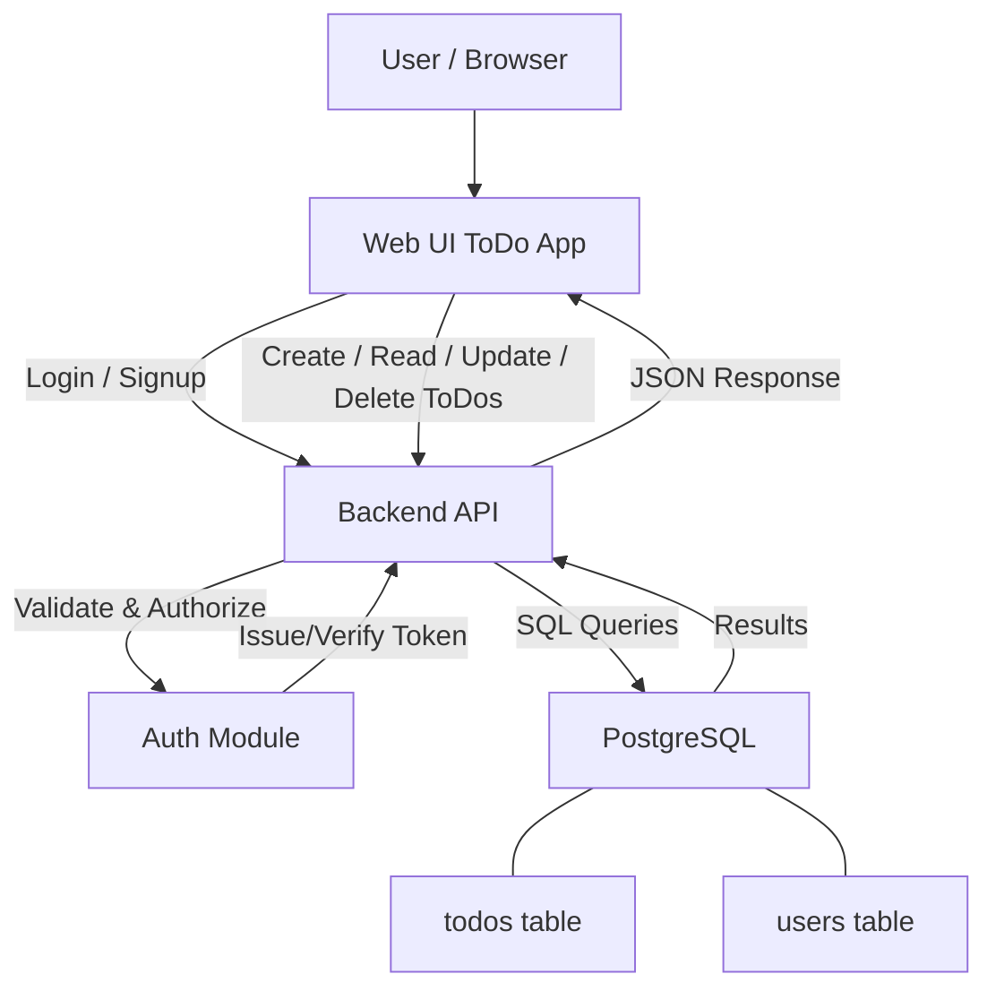

# Project Summary: To-Do Web App Using Next.js and PostgreSQL

## Introduction
This document outlines a comprehensive project plan for developing a to-do web application utilizing the powerful Next.js framework and PostgreSQL for database management. The project aims to create a user-friendly, efficient, and reliable platform for users to manage their tasks and to-dos effectively.

## Key Ideas and Concepts

### To-Do Web Application
- **Purpose**: To provide a platform where users can easily add, manage, and track their daily tasks and to-dos.
- **Core Features**:
  - Task addition, deletion, and updating.
  - Categorization of tasks.
  - Prioritization and deadlines.
  - User authentication and personalization.

### Technology Stack
- **Frontend**: Next.js
  - Chosen for its server-side rendering capabilities, which enhance SEO and performance.
- **Backend**: PostgreSQL
  - A robust and reliable database system to manage user data and tasks efficiently.
- **Authentication**: NextAuth.js or similar technology for secure user authentication and session management.



## Problems Identified and Solutions Proposed

### Problem 1: Task Management Efficiency
- **Issue**: Users often struggle with managing their tasks effectively, leading to decreased productivity.
- **Solution**: Implement an intuitive UI that allows for easy addition, modification, and deletion of tasks. Incorporate features like drag-and-drop for task prioritization and calendars for deadline management.

### Problem 2: Data Persistence and Security
- **Issue**: Ensuring user data is safe and persistent.
- **Solution**: Utilize PostgreSQL for reliable data storage, along with proper encryption and security measures for user data protection. Implement regular backups and a robust authentication system.

## Target Audience Insights

- **Primary Audience**: Individuals seeking to improve personal productivity and task management.
- **Needs and Preferences**:
  - A simple, intuitive user interface.
  - Mobile responsiveness for managing tasks on the go.
  - Secure login and data protection. ok

## Technical Considerations

- **Next.js**:
  - Leverage its SSR features for better performance and user experience.
  - Explore static site generation (SSG) for static pages like Help or About.
- **PostgreSQL**:
  - Design a normalized database schema to efficiently manage tasks, categories, and user information.
  - Implement prepared statements to protect against SQL injection attacks.
- **Authentication**:
  - Consider using NextAuth.js for a streamlined authentication process that supports various providers and ensures security.


## Next Steps and Recommendations

1. **Project Planning**:
   - Define detailed user stories and acceptance criteria.
   - Create a project timeline with milestones for development, testing, and deployment.

2. **Design Phase**:
   - Develop wireframes and mockups for the UI/UX design.
   - Validate designs with potential users to gather feedback.

3. **Development Phase**:
   - Set up the development environment with Next.js and PostgreSQL.
   - Start with the backend, establishing the database schema and API endpoints.
   - Proceed with frontend development, focusing on responsive design and user experience.

4. **Testing and Iteration**:
   - Conduct thorough testing, including unit tests, integration tests, and user testing.
   - Iterate based on feedback and test results to refine the application.

5. **Launch and Post-Launch Activities**:
   - Prepare for launch with a marketing strategy targeting the identified audience.
   - Post-launch, focus on user feedback and analytics for continuous improvement.

6. **Documentation and Support**:
   - Ensure comprehensive documentation is available for users and developers.
   - Set up a support system for handling user queries and issues.

By following these steps and focusing on the key areas identified, the project aims to develop a to-do web application that meets the needs of its target audience, leveraging the strengths of Next.js and PostgreSQL.


To incorporate a theme into the document, we'll need to define what the theme is and then strategically integrate it throughout the document to ensure coherence and enhance the narrative around the to-do web application project. A theme can help set the tone, guide design decisions, and make the application more engaging for users. Let's consider a theme of "Productivity and Personal Growth" for this project. 

### Suggested Changes:

**Section**: Introduction  
**Old Content**:  
This document outlines a comprehensive project plan for developing a to-do web application utilizing the powerful Next.js framework and PostgreSQL for database management. The project aims to create a user-friendly, efficient, and reliable platform for users to manage their tasks and to-dos effectively.

**New Content**:  
This document outlines a comprehensive project plan for developing a to-do web application utilizing the powerful Next.js framework and PostgreSQL for database management, all under the guiding theme of "Productivity and Personal Growth". This theme not only shapes the app's design and features but also aligns with our goal to create a user-friendly, efficient, and reliable platform that empowers users to manage their tasks and to-dos effectively, thereby fostering personal development and efficiency.

**Explanation**:  
Introducing a theme at the outset gives the project a clear direction and purpose. "Productivity and Personal Growth" is a theme that resonates well with the intended functionality of the app, making the project more appealing to potential users and stakeholders by emphasizing its role in improving users' daily lives.

**Section**: Key Ideas and Concepts  
**Old Content**:  
- **Purpose**: To provide a platform where users can easily add, manage, and track their daily tasks and to-dos.  
- **Core Features**:  
  - Task addition, deletion, and updating.  
  - Categorization of tasks.  
  - Prioritization and deadlines.  
  - User authentication and personalization.

**New Content**:  
- **Purpose**: To provide a platform that not only enables users to easily add, manage, and track their daily tasks and to-dos but also encourages productivity and personal growth through its design and features.  
- **Core Features**:  
  - Task addition, deletion, and updating with motivational prompts.  
  - Categorization of tasks to streamline focus areas and goals.  
  - Prioritization and deadlines with progress tracking to celebrate achievements.  
  - User authentication and personalization to create a tailored growth experience.

**Explanation**:  
Adjusting the description of the purpose and core features to reflect the theme provides a clearer picture of how the application will function within the context of "Productivity and Personal Growth". It suggests an enriched user experience, where the app not only serves as a task manager but also as a tool to motivate and track personal development.

Incorporating a theme into the document in this manner ensures that the project plan is not just about building a functional tool, but about creating an application that has a meaningful impact on its users by aligning with broader goals of productivity and personal growth.

To add theme information effectively to the document, it's important to integrate it in a way that complements the existing content and highlights the visual and user experience goals of the web application. Here's how you can structure this addition:

### Section to be added: Theme Information

## Theme and User Interface Design
- **Objective**: To create a visually appealing and intuitive user interface that enhances user experience and engagement.
- **Design Philosophy**: The design will be minimalist, focusing on ease of navigation and clarity of tasks. This approach aims to reduce user cognitive load and make task management more efficient.
- **Color Scheme**: A soft, neutral color palette will be used to promote a calming and focused environment for task management. Accents of vibrant colors will be introduced for categorization and prioritization features to help users quickly identify task status and categories.
- **Typography**: Modern, readable fonts will be chosen to ensure that text is easy to read across devices. The goal is to balance aesthetics with functionality, making sure that users can comfortably interact with the app for extended periods.
- **Responsive Design**: The application will be designed to be fully responsive, ensuring a seamless experience across various devices and screen sizes. This is crucial for users who switch between devices when managing their tasks.

hai 1 22

#### Explanation
Adding a section on theme and user interface design provides a holistic view of the project, emphasizing not only the technical aspects but also the user experience and visual appeal. This addition showcases the project's commitment to creating a product that is not only functional but also enjoyable to use. It helps stakeholders understand the importance of design in achieving the project's overall objectives and sets clear expectations for the aesthetic and usability aspects of the web application.

To incorporate the theme information into the document effectively, it should be integrated in a way that highlights the overarching goals and aesthetic direction of the to-do web application. Here's a structured suggestion for adding this information:

### Section to be added: Theme and Design Aesthetics
- **Old content**: Not applicable, as this is a new addition.
- **New content**:
  ```
  ## Theme and Design Aesthetics

  The to-do web application will adopt a minimalist and intuitive design theme to enhance user experience and focus. The theme will be characterized by:

  - **Simplicity**: A clean and uncluttered interface to facilitate ease of use.
  - **Accessibility**: High contrast and adaptable font sizes for better readability and accessibility.
  - **Interactivity**: Responsive design elements that provide immediate feedback to user interactions.
  - **Customization**: Options for users to personalize their interface and task management experience according to their preferences.

  This design direction supports the application's core purpose by removing distractions and enabling users to focus on their tasks more effectively. It also underscores the application's commitment to inclusivity and personalization, ensuring a broad appeal.
  ```

- **Explanation**: Adding a section on Theme and Design Aesthetics provides a clearer picture of the visual and user experience goals of the to-do web application. It clarifies the intended look and feel of the app, which is essential for developers, designers, and stakeholders to align their efforts towards a cohesive product. This addition enriches the document by detailing not just the functional, but also the aesthetic aspirations of the project, ensuring a well-rounded development approach.